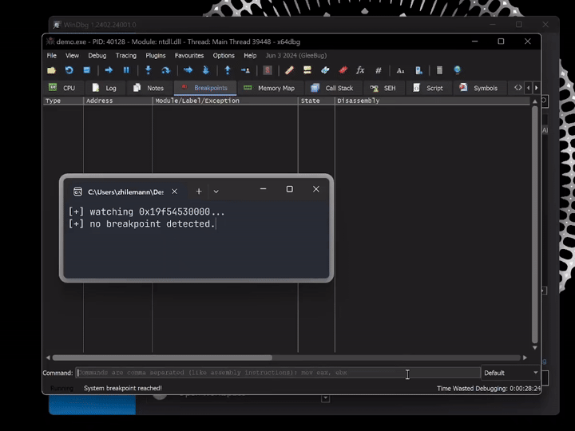

# `spec-fault` - a syscall-free memory fault oracle

## what is this?

`spec-fault` **"predicts" whether reading said memory will raise an exception** via [side-channel speculative execution][spectre-meltdown].

the [demo](./demo.c) (shown above) uses `spec-fault` to **detect memory breakpoints and protect critical memory from debuggers**.

_you can find the in-depth explanations in the [write-up](./.md/WRITE-UP.md)_.

## disclaimer!

while the GIF above does look _pretty cool_, this method, like any other timing-based technique, **is inherently not 100% accurate**.

moreover, while a memory breakpoint does cause a exception, **not every exception is due to a breakpoint**.

please bear this in mind when evaluating this project.

## credits
- [@can1357][can1357]'s [`haruspex`][haruspex] - inspiration and the spec-exec trigger

[spectre-meltdown]: https://en.wikipedia.org/wiki/Transient_execution_CPU_vulnerability
[can1357]: https://blog.can.ac
[haruspex]: https://github.com/can1357/haruspex
